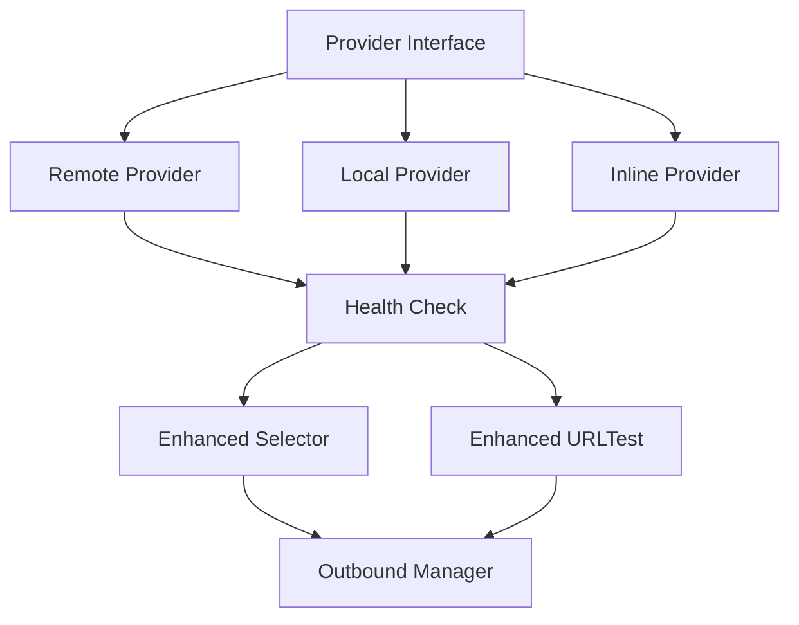

# amuae-sing-box


基于官方 [SagerNet/sing-box](https://github.com/SagerNet/sing-box) 的Provider支持版本，集成了高级订阅管理和节点健康监控功能。

## 🚀 核心特性

### 📦 Provider支持
- **🌐 远程Provider**: 自动获取和更新订阅链接
- **📁 本地Provider**: 从本地JSON文件加载配置  
- **📝 内联Provider**: 直接在配置中定义节点列表

### 🔧 增强功能
- ✅ **智能健康检查**: 自动监控节点可用性
- ✅ **定时自动更新**: 灵活的订阅更新策略
- ✅ **高级节点过滤**: 支持正则表达式包含/排除规则
- ✅ **增强选择器**: Selector/URLTest组原生支持Provider
- ✅ **配置验证**: 扩展的配置选项和格式验证

## 📋 快速开始

### 🎯 配置示例

<details>
<summary>📖 完整配置示例 (点击展开)</summary>

```json
{
  "log": {
    "level": "info",
    "timestamp": true
  },
  "providers": [
    {
      "tag": "机场订阅",
      "type": "remote",
      "remote_url": "https://example.com/subscription?token=xxx",
      "download_interval": "6h",
      "download_ua": "clash.meta",
      "includes": ["🇭🇰", "🇺🇸", "🇯🇵"],
      "excludes": ["过期", "维护"],
      "health_check": {
        "enable": true,
        "url": "https://www.gstatic.com/generate_204",
        "interval": "10m"
      }
    },
    {
      "tag": "本地备用",
      "type": "local",
      "path": "./backup-nodes.json",
      "health_check": {
        "enable": true,
        "interval": "15m"
      }
    }
  ],
  "inbounds": [
    {
      "tag": "mixed-in",
      "type": "mixed",
      "listen": "127.0.0.1",
      "listen_port": 2080
    }
  ],
  "outbounds": [
    {
      "tag": "proxy",
      "type": "selector",
      "outbounds": [
        "auto",
        "provider://机场订阅",
        "provider://本地备用",
        "direct"
      ]
    },
    {
      "tag": "auto",
      "type": "urltest",
      "outbounds": [
        "provider://机场订阅"
      ],
      "url": "https://www.gstatic.com/generate_204",
      "interval": "10m"
    },
    {
      "tag": "direct",
      "type": "direct"
    }
  ],
  "route": {
    "rules": [
      {
        "domain_suffix": [".cn"],
        "outbound": "direct"
      }
    ],
    "final": "proxy",
    "auto_detect_interface": true
  }
}
```
</details>

### 💡 基础配置

```json
{
  "providers": [
    {
      "tag": "my-subscription",
      "type": "remote",
      "remote_url": "https://example.com/subscription",
      "download_interval": "24h"
    }
  ],
  "outbounds": [
    {
      "tag": "proxy",
      "type": "selector", 
      "outbounds": ["provider://my-subscription", "direct"]
    }
  ]
}
```

## 🛠️ 构建与安装

### 🚀 自动构建 (推荐)

1. 访问 [Actions页面](../../actions/workflows/build-with-provider.yml)
2. 点击 **"Run workflow"**
3. 配置构建参数：
   - **上游仓库**: 默认 `SagerNet/sing-box`
   - **分支/标签**: 如 `v1.13.0-alpha.14` 或 `dev-next`
   - **构建平台**: 选择目标平台
   - **启用测试**: 验证Provider功能
4. 等待构建完成，在 [Releases](../../releases) 下载

### 📱 支持平台
- **Linux**: AMD64, ARM64  
- **Windows**: AMD64
- **Android**: ARM64

### 🔨 手动构建

```bash
# 克隆官方仓库
git clone -b dev-next https://github.com/SagerNet/sing-box.git
cd sing-box

# 应用Provider补丁
curl -O https://raw.githubusercontent.com/amuae/amuae-sing-box/main/apply-patches.sh
curl -L https://github.com/amuae/amuae-sing-box/archive/main.tar.gz | \
  tar -xz --strip-components=1 amuae-sing-box-main/patches

chmod +x apply-patches.sh
./apply-patches.sh

# 构建 (使用官方标签)
go build -tags "with_gvisor,with_quic,with_dhcp,with_wireguard,with_utls,with_acme,with_clash_api,with_tailscale" \
  ./cmd/sing-box
```

## � 文档

### 📖 详细文档
- **[Provider完整文档](docs/PROVIDER.md)** - 详细配置说明和示例
- **[官方文档](https://sing-box.sagernet.org)** - sing-box官方文档

### 🎯 Provider类型

| 类型 | 描述 | 使用场景 |
|------|------|----------|
| `remote` | 远程订阅 | 机场订阅、自动更新 |
| `local` | 本地文件 | 静态配置、备用节点 |
| `inline` | 内联配置 | 简单配置、测试节点 |

### ⚙️ 高级功能

<details>
<summary>🔍 健康检查配置</summary>

```json
{
  "health_check": {
    "enable": true,
    "url": "https://www.gstatic.com/generate_204",
    "interval": "10m",
    "timeout": "5s",
    "lazy": false,
    "expected_status": 204
  }
}
```
</details>

<details>
<summary>🎯 过滤规则</summary>

```json
{
  "includes": [
    "🇭🇰|香港|HK|Hong Kong",
    "🇺🇸|美国|US|United States"
  ],
  "excludes": [
    "过期|到期|Expire",
    "测试|Test.*"
  ]
}
```
</details>

## 🔄 自动化工作流

### 📋 构建流程
1. **环境准备** → 设置Go 1.23.1环境
2. **源码获取** → 从官方仓库拉取最新代码  
3. **补丁应用** → 自动应用Provider支持补丁
4. **配置测试** → 验证Provider配置解析
5. **多平台构建** → 编译所有目标平台
6. **发布管理** → 创建Release和构建产物

### 🔧 补丁系统
```
patches/
├── new-files/          # 新增的Provider文件
├── modifications/      # 现有文件的修改补丁  
└── apply-patches.sh    # 自动应用脚本
```

## 🏗️ 架构设计



### 📁 核心组件

**新增文件**:
- `common/provider/` - Provider核心实现
- `adapter/provider.go` - Provider适配器  
- `option/provider.go` - Provider配置选项

**增强文件**:
- `box.go` - 集成Provider服务
- `option/options.go` - 主配置扩展
- `option/group.go` - 组配置增强

## 🐛 故障排除

### ❓ 常见问题

<details>
<summary>Provider无法加载</summary>

- 检查网络连接和URL可访问性
- 验证订阅格式是否正确  
- 查看日志中的错误信息
- 确认`download_detour`配置正确
</details>

<details>
<summary>节点不出现在选择器中</summary>

- 检查`includes`和`excludes`规则
- 确认Provider标签正确引用: `provider://tag-name`
- 验证Provider是否成功加载节点
- 查看健康检查状态
</details>

### 🔍 调试方法

```bash
# 配置验证
./sing-box format -c config.json

# 配置检查  
./sing-box check -c config.json

# 详细日志
./sing-box run -c config.json --debug
```

## 🤝 贡献

欢迎提交Issue和Pull Request！

- **Bug报告**: 请提供详细的错误信息和配置
- **功能建议**: 描述具体的使用场景和需求
- **补丁更新**: 基于最新官方代码测试和验证

## 🔗 相关链接

- **[🏠 官方sing-box](https://github.com/SagerNet/sing-box)** - 上游官方仓库
- **[📦 Releases](../../releases)** - 下载预编译版本  
- **[🚀 Actions](../../actions)** - 查看构建状态
- **[📖 Provider来源](https://github.com/yelnoo/sing-box)** - 功能原始实现

## 📄 许可证

基于官方sing-box的GPL v3许可证，Provider功能基于yelnoo/sing-box实现。

---

<div align="center">

**🤖 全自动构建 • 🔄 持续集成 • 📦 即时发布**

> 本仓库通过补丁系统保持与官方的完全兼容性  
> 每次构建都基于最新官方源码，确保功能稳定可靠

[](https://github.com/amuae/amuae-sing-box/stargazers)
[](https://github.com/amuae/amuae-sing-box/network)

</div>